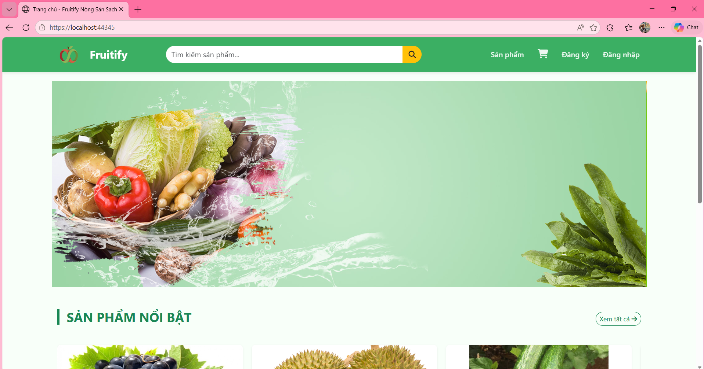
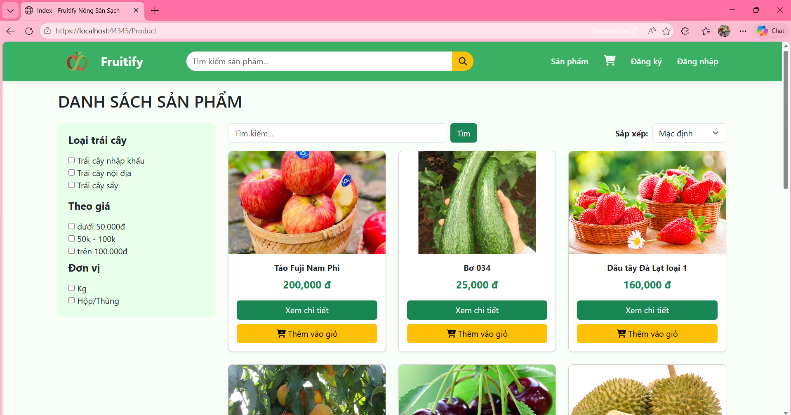
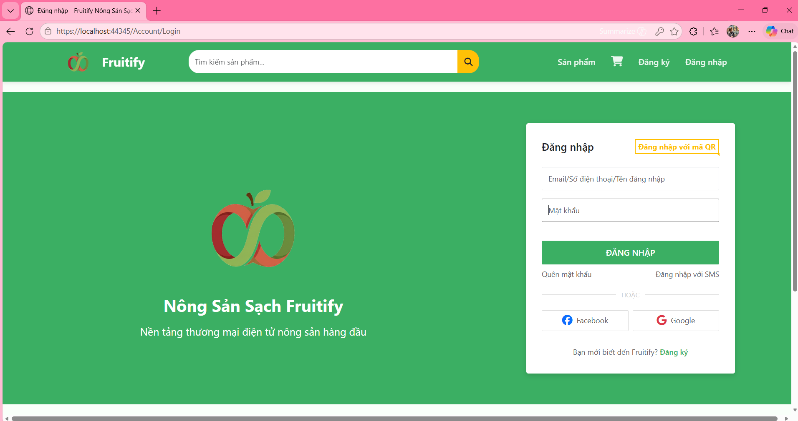
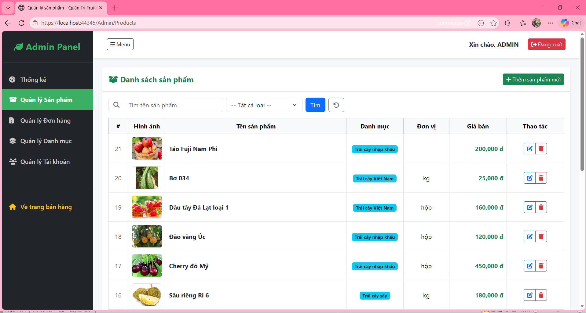

# Fruit Selling Website

This is an academic project developed for the Web Programming course.

## Technologies

* ASP.NET MVC
* C#
* SQL Server
* HTML/CSS
* Bootstrap

## Features

* User registration and login
* Product management and product details
* Product filtering, sorting and searching
* User-friendly website interface

## My Contributions

* Participated in analyzing website functions and user requirements.
* Developed user registration and login features.
* Supported product display, filtering and searching functions.
* Participated in front-end development and testing tasks.

## Screenshots

### Homepage

### Product Page

### Login Page

### Admin Product Management

